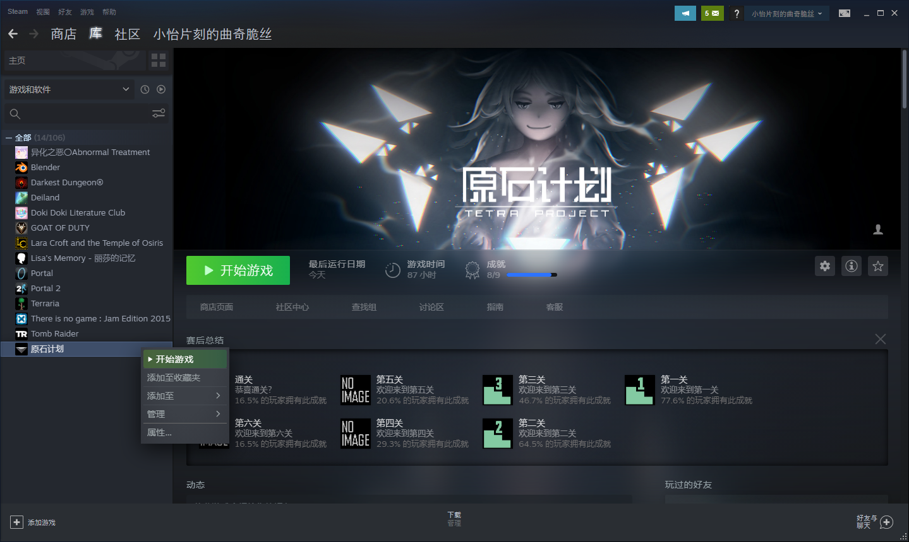
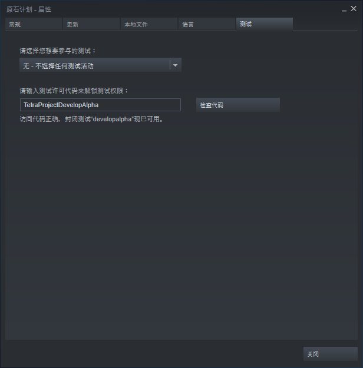

# 原石计划MOD喵喵向教程

作者：<a href="#作者" style="text-decoration:none">小怡片刻的曲奇脆丝</a>

> **注意　本教程可能会出现以下内容**
>
> 胡言乱语　胡言乱语　胡言乱语
>
> 为了你的人身安全及时空利益，请慎重阅读此教程。
>
> 你可以选择从本教程的任何一章开始阅读。

## 阅读提示

* 普蓝色的文字为链接，单击即可跳转至对应部分，带🌐的为**外部链接**。

## <a name="目录">目录</a>　点击章节标题即可跳转至对应章节

### <a href="#第〇章" style="text-decoration:none">准备——你已经成为了计划的一部分</a>

### <a href="#第一章" style="text-decoration:none">第一章</a>

### <a href="#第二章" style="text-decoration:none">第二章</a>

### <a href="#第三章" style="text-decoration:none">第三章</a>

### <a href="#附录" style="text-decoration:none">附录</a>

## <a name="第〇章">准备　你已经成为了计划的一部分</a>

### 欢迎来到原石计划。

> 《原石计划》是一个战棋+卡牌+Roguelike+DBG的游戏，并且有着对创意工坊MOD的极大支持。
>
> <a href="https://store.steampowered.com/app/1017410" style="text-decoration:none">🌐Steam上的原石计划</a>

这里可以看到，Alive使用了4条词汇来描述《原石计划》这个游戏，下面就是关于这些词汇的定义：

> <a href="https://www.baidu.com" style="text-decoration:none">🌐游戏基础知识全科普</a>　自己动手，丰衣足食。

那么……什么是“MOD”呢？

> MOD是Modify的缩写，意为“修改”。

由此可见，MOD制作即对游戏资源修改。原石计划对MOD制作有极大的支持，它允许玩家进入开发模式修改游戏资源文件夹并打包为MOD上传到创意工坊。目前可修改的内容有卡牌、角色、地图、剧情、特效、音乐等。

> 来试试原石计划的终极玩法？

用原石计划可是能制作：

* 卡牌游戏
* 战棋游戏
* 回合制游戏
* 即时制游戏
* 乙女游戏
* 别的游戏

~~总之，没有你想不到，只有Alive支持不到。~~

### 准备好了吗？　不你没有

要制作MOD，首先要~~在Steam上购买原石计划<a href="https://store.steampowered.com/app/1017410" style="text-decoration:none">🌐Steam上的原石计划</a>，~~进入原石计划的开发分支。

> Steam -> 库 -> 右击 原石计划 -> 属性 -> 测试 -> 输入 TetraProjectDevelopAlpha -> 选择 developalpha
>
> <a href="http://tpdocs.alivegamestudio.com/"  style="text-decoration:none">🌐MOD文档</a>
>
> 操作详解：
>
> 启动Steam，进入库，次要键（一般为右键）单击“原石计划”（或者选择“原石计划”，单击右侧的齿轮图标（即“管理”）），选择“属性…”
>
> 
>
> 选择“测试”标签页，输入“TetraProjectDevelopAlpha”，单击“检查代码”，**确认游戏未运行后**单击带有倒三角图标的按钮，在下拉列表中选择“developalpha - ”
>
> 
>
> 单击“关闭”，等待游戏更新完毕即可

<a name="作者">联系方式</a>

